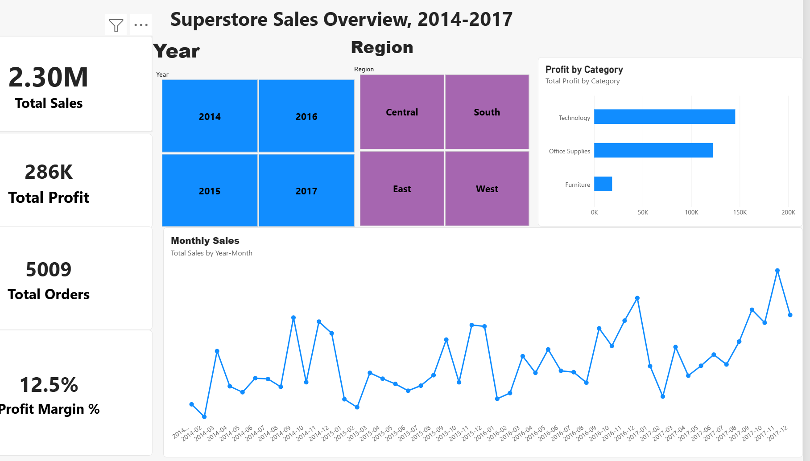
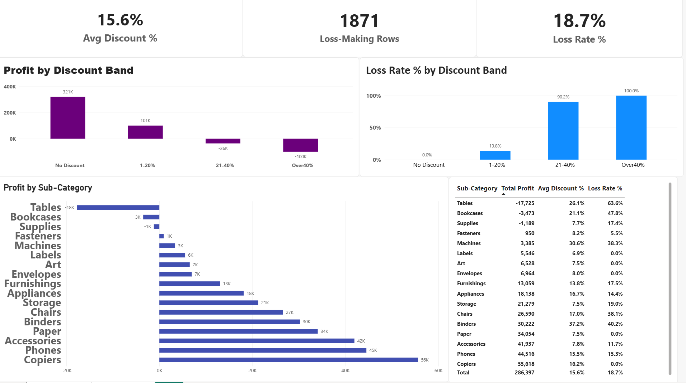

# Superstore Sales Dashboard (Power BI)

## Business Question
Do heavy discounts turn profitable sales into losses, and where does it happen most?

## Dataset
- **Source:** Superstore Dataset (vivek468) on Kaggle - https://www.kaggle.com/datasets/vivek468/superstore-dataset-final
- **Size:** 9,994 rows, 21 original columns
- **Period:** orders from 3 January 2014 to 30 December 2017
- **Columns include:** Order Date, Ship Date, Ship Mode, Customer, Segment, City, State, Region, Category, Sub-Category, Product Name, Sales, Quantity, Discount, Profit
- **Note:** this is a sample dataset of a fictional store, so it contains no real customer data.

## Tools Used
Power BI Desktop (Power Query, data modeling, DAX)

## Data Cleaning (Power Query)

| Problem | Columns | How I fixed it |
|---|---|---|
| Dates were stored as text in month/day/year order. The default import settings misread them and produced errors. | Order Date, Ship Date | Converted to Date type using the English (United States) locale. Result: 0 errors and no rows removed. |
| Postal Code was stored as a number | Postal Code | Changed to Text, since it is an identifier and not something to add up. |

**Quality checks:** I profiled the entire dataset, not just the first 1,000 rows. Every column was 100% valid, with 0% errors and 0% empty cells. Row ID runs from 1 to 9,994 with one ID per row, so there were no duplicate rows. Repeated Order IDs and Customer IDs are expected, because one order can contain several products and customers order more than once.

**Data loss check:** at first I removed the rows with date errors, which left only 2,739 of 9,994 rows. I noticed because the Row ID maximum did not match the row count. I undid that step and fixed the locale instead, which kept every row. Lesson: errors in a column usually mean a wrong setting, so fix the cause instead of deleting the rows.

## Data Model and DAX Measures

**Model:** one table of orders (Orders) connected to a Date Table that covers 1 January 2014 to 31 December 2017 and is marked as the date table. The link is on Order Date, many-to-one, with a single filter direction.

**Extra column added in Power Query:** Discount Band (No discount, 1-20%, 21-40%, Over 40%).

**Measures**

| Measure | DAX | Purpose |
|---|---|---|
| Total Sales | `SUM(Orders[Sales])` | Overall sales |
| Total Profit | `SUM(Orders[Profit])` | Overall profit |
| Profit Margin % | `DIVIDE([Total Profit], [Total Sales])` | Profit as a share of sales |
| Total Orders | `DISTINCTCOUNT(Orders[Order ID])` | Number of distinct orders |
| Loss-Making Rows | `COUNTROWS(FILTER(Orders, Orders[Profit] < 0))` | Order lines that lost money |
| Loss Rate % | `DIVIDE([Loss-Making Rows], COUNTROWS(Orders))` | Share of order lines that lost money |
| Avg Discount % | `AVERAGE(Orders[Discount])` | Average discount given |
| Sales Previous Year | `CALCULATE([Total Sales], SAMEPERIODLASTYEAR('Date Table'[Date]))` | Sales in the same period of the previous year |
| Sales YoY % | `DIVIDE([Total Sales] - [Sales Previous Year], [Sales Previous Year])` | Year-over-year sales growth |
| Profit Previous Year | `CALCULATE([Total Profit], SAMEPERIODLASTYEAR('Date Table'[Date]))` | Profit in the same period of the previous year |
| Profit YoY % | `DIVIDE([Total Profit] - [Profit Previous Year], [Profit Previous Year])` | Year-over-year profit growth |

**Validation:** my totals match the known figures for this dataset (sales of 2,297,200.86 and 5,009 distinct orders). Yearly sales were 484,247.50 in 2014, 470,532.51 in 2015, 609,205.60 in 2016 and 733,215.26 in 2017, giving year-over-year growth of -2.8%, 29.5% and 20.4% for 2015 to 2017. The year-over-year measures are blank for 2014 because the data has no earlier year.

## Dashboard

**Overview page:** KPI cards (Total Sales, Total Profit, Profit Margin %, Total Orders), Year and Region slicers, a monthly sales trend and profit by category.

**Discount page:** average discount, loss-making order lines, loss rate, profit and loss rate by discount band, profit by sub-category, and a table linking discounts to losses.

## Key Findings

**Overall:** 2,297,200.86 in sales, 286,397 in profit (a 12.5% margin) and 5,009 orders between January 2014 and December 2017.

**Growth:** yearly sales were 484,247.50 (2014), 470,532.51 (2015), 609,205.60 (2016) and 733,215.26 (2017). Year-over-year growth was -2.8% in 2015, 29.5% in 2016 and 20.4% in 2017.

**Categories:** Technology earned the most profit (about 145,500), followed by Office Supplies (about 122,500). Furniture earned only about 18,500 despite being a major category.

**Discounts and profit (the main question):**

| Discount band | Total profit | Share of order lines that lost money |
|---|---|---|
| No discount | about 321K | 0.0% |
| 1-20% | about 101K | 13.8% |
| 21-40% | about -36K | 90.2% |
| Over 40% | about -100K | 100.0% |

Profit falls as discounts rise. Orders discounted by more than 20% lose money almost every time, and every order above 40% lost money.

**Where the losses are:** only three sub-categories lost money overall: Tables (-17,725), Bookcases (-3,473) and Supplies (-1,189). Tables and Bookcases carry heavy average discounts (26.1% and 21.1%) and high loss rates (63.6% and 47.8%). Machines are discounted by 30.6% on average and earn only 3,385. Labels, Art, Envelopes and Paper have average discounts of 8% or less and no loss-making order lines. Supplies lose money despite a low average discount (7.7%), so discounts do not explain every loss.

## Recommendations

1. Set a review or approval step for discounts above 20%, since the 21-40% and Over 40% bands lose money on 90% or more of order lines.
2. Review the pricing and discounting of Tables and Bookcases, which account for most of the losses.
3. Investigate Supplies separately, because it loses money at low discounts. Costs or pricing may be the cause.
4. Review the heavy discounts on Machines, which earns little profit relative to its discount level.
5. Protect the strongest earners: Copiers, Phones and Accessories.

## Limitations

- This is a sample dataset of a fictional store, so the findings show what the data says and not what a real business should do.
- The dataset has no cost information, so I cannot say why a product loses money beyond the discount it received.
- The link between discounts and losses is an observed pattern and not proof of cause. For example, Copiers have a 16.2% average discount and no loss-making order lines.
- Loss rate counts order lines, not whole orders.
- I did not test the results statistically.

## Contact
Bismark Amatey Ayerteye | [Add your LinkedIn link]
